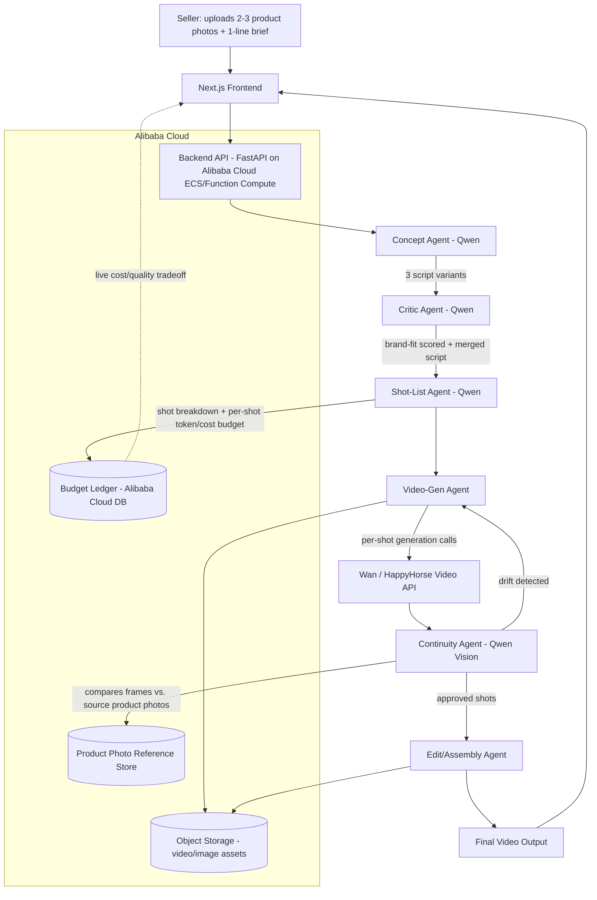

# ProductCut — AI Product Video Studio for Small E-Commerce Sellers
### Global AI Hackathon with Qwen Cloud — Track 2: AI Showrunner

---

## 1. Problem Statement

Small Etsy/Shopify sellers cannot afford professional product video ads. A single 15–30 second ad video from a freelance studio costs $300–$1500 and takes days. Most sellers instead post static photos, which convert worse than video across every major ad platform.

**ProductCut** lets a seller upload 2–3 product photos and a one-line creative brief (e.g. *"handmade ceramic mugs, cozy autumn vibe"*) and receive a finished 15–30 second product ad video, generated end-to-end by a coordinated crew of AI agents running on Qwen Cloud.

This is not a general "type an idea, get any video" tool. The scope is deliberately narrow: **short-form product ad video for e-commerce sellers**, because narrow scope is what makes the agent pipeline's decisions (script choice, shot budget, visual consistency) meaningfully checkable and demoable in a hackathon timeframe.

---

## 2. Why This Fits Track 2 (AI Showrunner)

| Track 2 requirement | How ProductCut addresses it |
|---|---|
| Autonomously handles scriptwriting → storyboarding → video generation → editing | Concept Agent → Shot-List Agent → Video-Gen Agent → Edit/Assembly Agent, fully pipelined |
| Demonstrate narrative ability | Concept Agent produces multiple script variants scored for brand-fit, not a single best-guess script |
| Multimodal orchestration | Text (script) → image (product photos, reference frames) → video (Wan/HappyHorse) → final cut |
| Maximize output quality under a limited token budget | Explicit per-shot token/cost budget enforced by the Shot-List Agent, visualized in a live cost dashboard |

---

## 3. System Architecture

### 3.1 Architecture Diagram

### 3.2 Text Description of Flow

1. Seller uploads photos + one-line brief via the Next.js frontend.
2. Request hits the FastAPI backend, deployed on Alibaba Cloud (Function Compute or ECS — see Section 6).
3. **Concept Agent** (Qwen) generates 3 short script variants from the brief.
4. **Critic Agent** (Qwen) scores each variant against a brand-fit rubric (tone match, pacing, CTA strength) and either picks the top script or merges strongest elements from two — this is the agent "negotiation/disagreement resolution" the track explicitly asks judges to look for.
5. **Shot-List Agent** breaks the winning script into 3–5 shots, assigning each shot an explicit token/cost budget so total spend stays inside a hard cap. This budget is written to a ledger and streamed live to the frontend as a cost/quality dashboard.
6. **Video-Gen Agent** calls Wan/HappyHorse per shot, using the product photos as visual reference.
7. **Continuity Agent** (Qwen vision) compares each generated frame against the original product photos to catch visual drift (wrong color, distorted shape, inconsistent framing). If drift exceeds a threshold, it triggers a bounded number of re-generations (capped, to respect the token budget) before falling back to flagging the shot for the user instead of looping forever.
8. **Edit/Assembly Agent** stitches approved shots, adds basic transitions/music timing, and outputs the final video to Alibaba Cloud Object Storage.
9. Frontend polls/streams status and displays the finished video plus the full cost/quality breakdown.

---

## 4. Agent Roster — Task & Implementation Detail

### 4.1 Concept Agent
- **Task:** Turn a 1-line brief + photos into 3 distinct short-form ad scripts (different tone/pacing/hook per variant).
- **Implementation:** Single Qwen call with structured JSON output (script text, tone tag, target length in seconds, hook type). Temperature raised slightly across the 3 generations to force actual variety rather than near-duplicate scripts.

### 4.2 Critic Agent
- **Task:** Score each script variant against a brand-fit rubric derived from the brief (tone match, clarity of CTA, pacing fit for 15–30s format) and select or merge the winner.
- **Implementation:** Qwen call given all 3 scripts + rubric, returns per-script scores + justification + final chosen/merged script. This is the "disagreement resolution" component — output includes the reasoning trace so it's visible in the demo, not a black box.

### 4.3 Shot-List Agent
- **Task:** Break the winning script into a shot list (3–5 shots), assign each shot a token/cost budget, and enforce a hard total cap.
- **Implementation:** Qwen call producing structured shot objects: `{shot_id, description, duration_sec, camera_note, allocated_budget}`. Budget allocation logic weights hero/CTA shots higher than establishing shots. Ledger entries written to the Alibaba Cloud DB for the live dashboard.

### 4.4 Video-Gen Agent
- **Task:** Generate each shot as video, using product photos as visual anchors.
- **Implementation:** Orchestration layer that calls Wan/HappyHorse per shot with the shot description + reference image, respecting the per-shot budget from Section 4.3. Failed/low-budget shots degrade gracefully (e.g., static Ken-Burns pan on the product photo) rather than blocking the whole pipeline — this directly demonstrates graceful degradation under constraint.

### 4.5 Continuity Agent
- **Task:** Detect visual drift between generated shots and the source product photos; trigger limited re-generation.
- **Implementation:** Qwen vision call comparing generated frame(s) to reference photos, returning a similarity/drift score. If drift > threshold, re-queues the shot to Video-Gen Agent (max 1–2 retries, budget-capped) or flags it for manual review in the UI if retries are exhausted.

### 4.6 Edit/Assembly Agent
- **Task:** Stitch approved shots into a final 15–30s cut with transitions and timing aligned to the script's pacing.
- **Implementation:** Deterministic assembly step (ffmpeg-based) driven by the shot list's duration/order metadata — not itself an LLM call, but logged as part of the pipeline for the architecture diagram.

---

## 5. Tech Stack

| Layer | Choice |
|---|---|
| Frontend | Next.js 14, React, Tailwind |
| Backend / Orchestration | FastAPI (Python), async agent orchestration |
| LLM / Reasoning | Qwen (via Qwen Cloud) for Concept, Critic, Shot-List, Continuity agents |
| Video Generation | Wan / HappyHorse |
| Video Assembly | ffmpeg |
| Database | Alibaba Cloud managed DB (budget ledger, job status) |
| Storage | Alibaba Cloud Object Storage (OSS) — photos, generated shots, final video |
| Deployment | Alibaba Cloud (Function Compute or ECS) — backend must run here for Proof of Deployment |
| Realtime status | WebSocket or polling from frontend to show pipeline progress + live cost dashboard |

---

## 6. Submission Requirements Checklist (per hackathon rules)

- [ ] Public GitHub repo with open-source license visible in the About section
- [ ] Proof of Alibaba Cloud deployment: recorded clip + linked code file showing Alibaba Cloud service/API usage (not just mentioned — actually called)
- [ ] Architecture diagram (Section 3.1 above, exported as image for submission page)
- [ ] ~3 minute demo video, uploaded publicly (YouTube/Vimeo/Facebook)
- [ ] Text description of features/functionality
- [ ] Track identified: **Track 2 — AI Showrunner**
- [ ] Optional: blog post documenting the build journey (Blog Post Prize eligibility)

---

## 7. Judging Criteria Alignment (self-check before submitting)

| Criterion | Weight | What to point to in the demo |
|---|---|---|
| Technical Depth & Engineering | 30% | Budget-aware shot generation, continuity re-gen loop, graceful degradation on failed shots |
| Innovation & AI Creativity | 30% | Critic Agent's script negotiation/merge step, cost/quality tradeoff dashboard |
| Problem Value & Impact | 25% | Named niche (Etsy/Shopify sellers), real cost-savings framing vs. hiring a studio |
| Presentation & Documentation | 15% | This proposal + architecture diagram + clear demo walkthrough of the agent handoffs |

---

## 8. Build Priority Order (given limited time before deadline)

1. Video-gen quality test (Wan/HappyHorse) — de-risk the biggest unknown FIRST, before writing any orchestration code.
2. Concept Agent + Critic Agent (cheap to build, directly hits Innovation criterion).
3. Shot-List Agent + budget ledger + dashboard (cheap, directly hits Technical Depth criterion).
4. Video-Gen Agent orchestration with graceful degradation fallback.
5. Continuity Agent — simplify to "flag drift" only if time runs out; full auto-regen loop is a stretch goal, not a dependency for a working demo.
6. Edit/Assembly Agent (ffmpeg stitch).
7. Frontend polish, architecture diagram export, demo video recording.

---

## 9. Known Risks

- **Video-gen output quality is the single largest risk to the whole submission** — if Wan/HappyHorse output looks poor, no amount of orchestration cleverness will save the demo. Test this before building anything else.
- Continuity re-generation loop could consume the entire token budget if not hard-capped — cap retries explicitly.
- Time constraint: agents 4.4 and 4.5 (Video-Gen, Continuity) are the highest-effort, highest-risk components; scope them down first if behind schedule.
