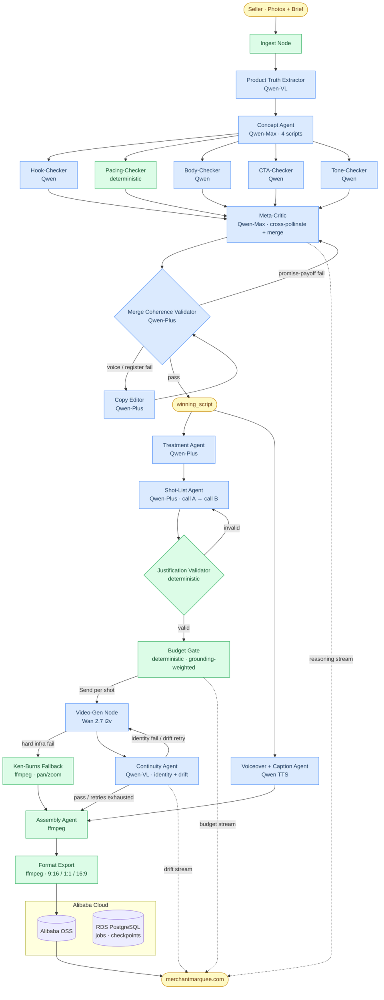

# Merchant Marquee

> **Three photos in. One honest ad out.**

An autonomous multi-agent pipeline that turns 2–3 product photos and a one-line creative brief into a finished, narrated, 15–30 second short-form video ad — script, voiceover, shots, and all. Built on Qwen Cloud, LangGraph, and Alibaba Cloud infrastructure.

[](https://github.com/Rithvik1811/merchant-marquee/actions/workflows/deploy.yml)
[](LICENSE)
[](https://www.python.org/)
[](https://nextjs.org/)

---

## What It Does

Small Etsy and Shopify sellers can't afford professional video ads ($300–$1,500 per clip, days of turnaround). Merchant Marquee closes that gap end-to-end:

1. Seller uploads 2–3 product photos and a one-line brief
2. A coordinated crew of 14 AI agents runs the full production chain — extracting product truths from photos, writing four structurally distinct ad scripts, negotiating a winner, directing the visual approach, generating video shots in parallel, checking every frame for drift, and assembling a final cut with synced voiceover and captions
3. A finished 15–30 second ad is delivered in three aspect ratios (9:16, 1:1, 16:9) with a full transparency breakdown of every creative decision

---

## Architecture



**Solid arrows** are graph edges. **Dashed arrows** are live streaming channels via `astream_events` → WebSocket. Diamonds are decision nodes that can loop, pause, or branch. `interrupt: Human Review` is a genuine LangGraph `interrupt()` — the graph checkpoints and resumes from the checkpoint on seller response.

---

## Pipeline Walk

| Stage | Node(s) | What happens |
|---|---|---|
| **1 — Ingest** | `Ingest Node` | Validates photos (2–3), stores to OSS, captures optional seller direction |
| **2 — Product Truths** | `Product Truth Extractor` (Qwen-VL) | Extracts 6–10 specific facts from uploaded photos — colors, materials, textures, scale cues. Every fact gets a `truth_id` that flows through all downstream nodes |
| **3 — Scripts** | `Concept Agent` (Qwen-Max) | Generates 4 structurally distinct ad scripts, each using a different copywriting framework (PAS, AIDA, BAB, Hook-Problem-Solution) |
| **4 — Critic Chain** | Hook / Pacing / Body / CTA / Tone checkers → `Meta-Critic` | Five specialist checkers score all four scripts in parallel. Meta-Critic cross-pollinates: picks the best hook, body, and CTA from across all variants and merges them |
| **5 — Merge Validation** | `Merge Coherence Validator` + `Copy Editor` | Independent Qwen-Plus node cold-reads the merged script. Voice failures route to the Copy Editor; promise-payoff failures route back to the Meta-Critic |
| **6 — Treatment** | `Treatment Agent` (Qwen-Plus) | Director's treatment: persona, color story, pacing philosophy, per-beat justifications citing verbatim script quotes and truth IDs |
| **7 — Shot List** | `Shot-List Agent` + `Justification Validator` | Two sequential Qwen calls. Call A: justifications only → validated. Call B: camera/composition fields conditioned on validated justifications |
| **8 — Budget Gate** | `Budget Gate` (deterministic) | Grounding-weighted allocation. If over cap: priority-ordered reduce — downgrade resolution, cut lowest-weight shots, redistribute via waterfill. No LLM re-invocation |
| **9 — Video Gen** | `Video-Gen Node` (Wan 2.7 i2v) + `Ken-Burns Fallback` | Shots fan out in parallel via LangGraph `Send()`. Every shot is image-to-video with the seller's reference photo. Hard failures degrade to Ken-Burns pan/zoom |
| **10 — Continuity** | `Continuity Agent` (Qwen-VL) | Early-frame identity check + drift score per shot. Up to 2 auto-retries; exhausted retries raise a real `interrupt()` for seller approval |
| **11 — Voiceover** | `Voiceover + Caption Agent` (Qwen TTS) | Parallel branch from script finalization. Synced audio track + caption timing aligned to beat timestamps |
| **12 — Assembly** | `Assembly Agent` (ffmpeg) | Stitches approved shots, overlays voiceover, burns captions and CTA into each shot's reserved zone |
| **13 — Export** | `Format Export Node` (ffmpeg) | Recomposes master cut into 9:16, 1:1, and 16:9. Zero additional video-gen cost |

---

## Agent Roster

| Agent | Model | Role |
|---|---|---|
| Product Truth Extractor | Qwen-VL | Photo → specific facts with truth IDs |
| Concept Agent | Qwen-Max | 4 distinct ad scripts, framework/hook/trigger forced diverse |
| Hook-Checker | Qwen | Score hook specificity and strength, 1–5 |
| Pacing-Checker | Deterministic | Validate timing math: beat sums, word rate, windows |
| Body-Checker | Qwen + deterministic pre-pass | Promise-payoff match, non-redundancy, throughline, trigger fidelity |
| CTA-Checker | Qwen | Single-verb CTA clarity + bridge/transition smoothness |
| Tone-Checker | Qwen | Brand fit + hard `never_do` rejection |
| Meta-Critic | Qwen-Max | Weighted composite + cross-pollinate best hook/body/CTA |
| Merge Coherence Validator | Qwen-Plus | Independent cold read: pacing recheck + voice/POV consistency |
| Copy Editor | Qwen-Plus | Constrained seam polish at flagged stitch points only |
| Treatment Agent | Qwen-Plus | Director's treatment: persona, color story, per-beat justification |
| Shot-List Agent | Qwen-Plus (2 calls) | Call A: justifications only → validated → Call B: camera/composition |
| Continuity Agent | Qwen-VL | Early-frame identity check + drift score per shot |
| Voiceover + Caption Agent | Qwen TTS | Synced audio track + caption timing |

---

## Tech Stack

| Layer | Technology |
|---|---|
| **Frontend** | Next.js 16, React 19, Tailwind CSS 4 |
| **Backend** | FastAPI (Python 3.10), async WebSocket streaming |
| **Orchestration** | LangGraph — conditional edges, `Send()` fan-out, `interrupt()`, Postgres checkpointer |
| **LLM / Reasoning** | Qwen-Max, Qwen-Plus (DashScope OpenAI-compatible endpoint) |
| **Vision** | Qwen-VL (product truth extraction, continuity drift scoring) |
| **Speech** | Qwen TTS / CosyVoice (DashScope Singapore endpoint) |
| **Video Generation** | Wan 2.7 image-to-video (DashScope endpoint) |
| **Video Assembly** | ffmpeg (deterministic — no LLM calls) |
| **Database** | Alibaba Cloud RDS PostgreSQL (jobs, budget ledger, LangGraph checkpoints) |
| **Storage** | Alibaba Cloud OSS (photos, shot clips, final videos) |
| **Deployment** | Alibaba Cloud ECS — Docker Compose + Nginx, GitHub Actions auto-deploy on push to `master` |
| **Realtime** | LangGraph `astream_events` → FastAPI WebSocket → browser |

---

## Deployment

Runs on Alibaba Cloud ECS behind Nginx + Docker Compose, continuously deployed via GitHub Actions on every push to `master`.

```
ECS instance (43.112.113.40) — merchantmarquee.com
├── Nginx (reverse proxy, SSL termination)
├── merchant-marquee-backend-1   FastAPI + LangGraph  :8000
└── merchant-marquee-frontend-1  Next.js              :3000
```

Every push to `master` → GitHub Actions SSHes into ECS → `git pull` → `docker compose up --build -d`. Environment secrets (API keys, DB URL, OSS credentials) live in `backend/.env` on the ECS instance — never baked into the image.

---

## Live Demo

**[https://merchantmarquee.com](https://merchantmarquee.com)** — upload any product photos and try it live.

---

## License

[MIT](LICENSE)
